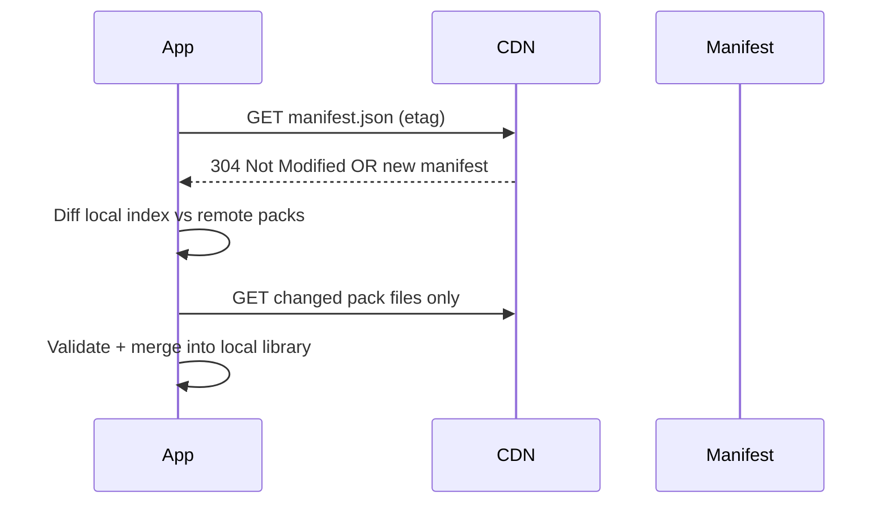

# Delta Update Philosophy

**Status:** Documented — not implemented.

This document explains how future AlephBits clients will sync content from `alephbits-content` without downloading the entire repository on every update.

## Problem

A mature content library may contain hundreds of books, multiple language variants per book, images, and revision history. Re-downloading everything on each app launch wastes bandwidth, storage, and reader patience.

## Principle: update the smallest useful unit

| Unit | What changes independently |
|------|--------------------------|
| Repository manifest | Catalog metadata, new pack entries, featured shelves |
| Book manifest | Book-level metadata, cover, revision history |
| Language variant | `lesson.json`, `text.txt`, `quiz.json` for one language |
| Asset | Cover image, inline figure |

**One updated book should not require downloading the whole repository.**

Example: Polish typo fixes in *Spacer po Krakowie* should download only the Polish variant files — not English, Spanish, or unrelated books.

## How it will work (future)



### Step 1 — Manifest diff

The app stores the last seen `repositoryVersion` and per-pack `version` + checksum. On sync:

1. Fetch top-level `manifest.json` (small, cacheable).
2. Compare `packs[]` entries against local index.
3. Identify added, updated, or removed packs.

### Step 2 — Book-level granularity

For multi-language books, fetch the book's `manifest.json` first:

```json
{
  "bookId": "spacer-po-krakowie",
  "availableTranslations": {
    "pl": { "path": ".", "version": "1.0.1" },
    "en": { "path": "../en/", "version": "1.0.0" }
  }
}
```

If only Polish changed, download `pl/` files only.

### Step 3 — Integrity

Each manifest entry will include `sha256` checksums. The app validates before replacing local files.

### Step 4 — Deprecation

Removed packs are marked `deprecated: true` in the manifest for one release cycle before hard removal. Installed copies remain readable.

## What is NOT in scope yet

- CDN hosting and release automation
- `build_manifest.dart` checksum generation
- App-side sync service
- Background delta downloads
- Peer-to-peer or torrent distribution

## Design constraints carried forward

1. **Stable paths** — `official/glagolitic/pl/spacer-po-krakowie/` never renames; new editions bump `version`.
2. **Split files** — `text.txt` and `quiz.json` enable small diffs and partial updates.
3. **Book manifest** — separates book identity from language variants.
4. **Flat pack index** — repository manifest enables O(n) diff without walking directories.

## Editorial implication

Editors should bump `version` in `lesson.json` and the repository manifest when publishing changes. Patch = typo fix, minor = quiz update, major = structural change.

## Related

- [MANIFEST.md](MANIFEST.md) — field reference
- [Reading Pack Specification — Synchronization](https://github.com/alephbits/alephbits/blob/main/docs/content/READING_PACK_SPECIFICATION.md#synchronization)
